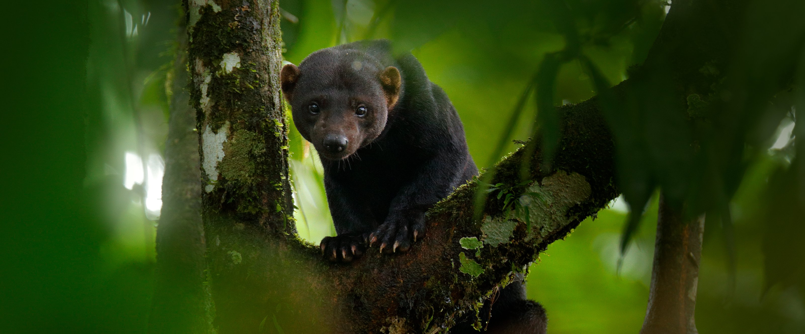

# Genomic variation in mustelids - Tayra (_Eira barbara_) genome project

This repo represents a collection of scripts for genome assembly, phylogenomics and genomic variation assessment in mustelids, accompanying the manuscript **Derežanin et al.(2022)"Multiple types of genomic variation contribute to adaptive traits in the mustelid subfamily Guloninae"** and sequencing data available under the NCBI Project ID: PRJNA732552.
Manuscript currently under revision (*Molecular Ecology*), preprint available at [bioRxiv](https://doi.org/10.1101/2021.09.27.461651).

* 01_Genome_assembly - 10xGenomics linked-reads preparation, assembly runs, genome metrics (autohor: Lorena Derezanin)
* 02_Phylogenetics - parsing nucleotide sequence alignments and estimating species divergence time (author: David A. Duchene Garzon)
* 03_Gene_family_evolution - inferring gene gains/losses from BUSCO output (authors: Lorena Derezanin and Dorina Meneghini)
* 04_Structural_variation - snakefiles with ordered steps for sequence preparation, structural variant calling, and functional annotation (author: Lorena Derezanin)

Additional scripts can be found at https://github.com/mahajrod/MACE

